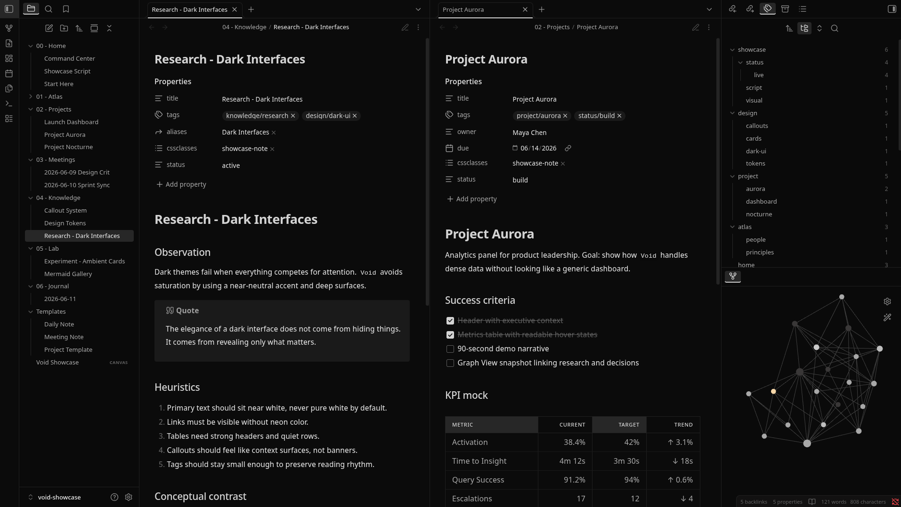
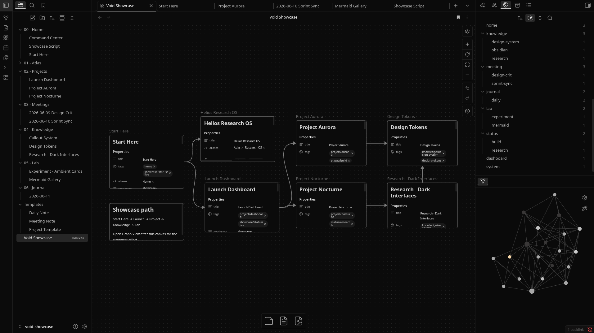

# Void

**Void** is a dark theme for Obsidian focused on a clean, quiet, and distraction-free workspace.

Built with a black and gray palette, subtle contrast, and minimal visual noise.

## Preview

### Notes View

---

### Canvas View

This theme is designed for dark mode only. In light mode, it may look bad and become hard to read.

## Installation

To install the theme

- Open Obsidian Settings
- Go to `Appearance` and click `Manage`
- Under community themes search for "Void" and click `Use`

## About

Void keeps Obsidian simple: dark surfaces, soft text, restrained accents, and a calm interface for writing, reading, and organizing notes.
